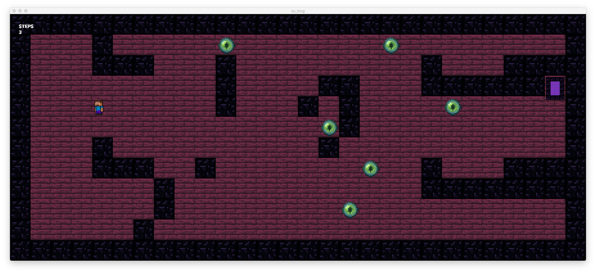

# so_long
1337 so_long project developing a 2D game that can parse any map using MiniLibX

## Description


## Getting Started

### Dependencies

* Mac OS/Linux
* MiniLibX

### Installing minilibx

* in Linux, clone this repo and compile it from here: [42 minilibx](https://github.com/42Paris/minilibx-linux)
* in MacOs you can the built-in Makefile in this project will compile and link libraries accordingly
* * the minilibx that comes with the project is for mac os only and it does not use X11 or XQuartz but Cocoa API from macos AppKit, consequently the makefile uses ```-framework AppKit```

### Makefile
To Compile Bonus:
```bash
$> make bonus
```
Mandatory Part:
```bash
$> make
```
### Executing program

```bash
$> Usage: ./so_long [map_file]
```
### Screenshots

## Resources

Inspiration, code snippets, etc.
* [minilibx docs](https://harm-smits.github.io/42docs/libs/minilibx)
* [minilibx](https://qst0.github.io/ft_libgfx/man_mlx.html)

